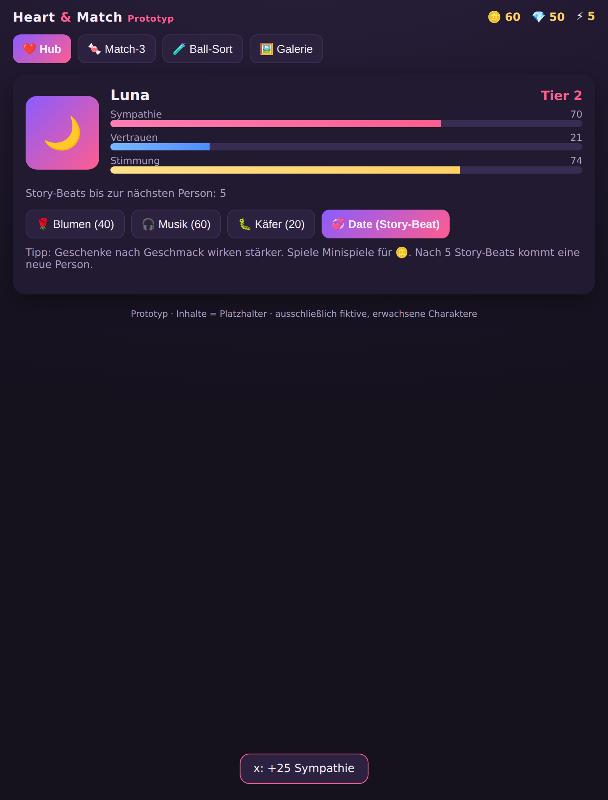
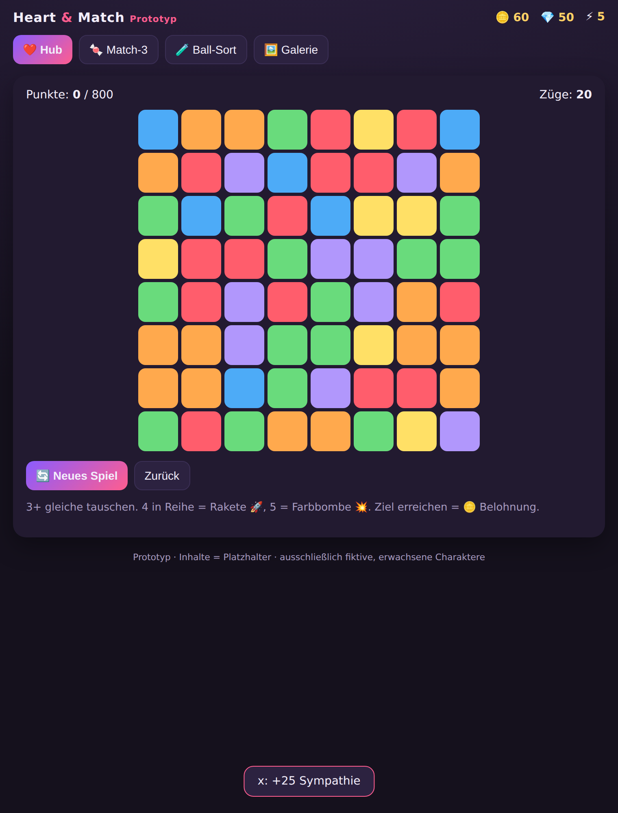
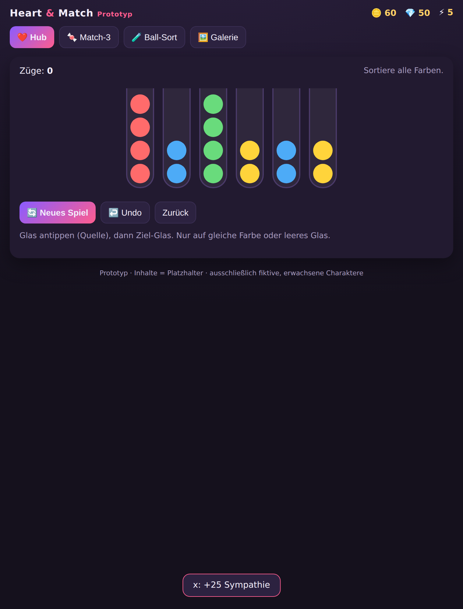

# Heart & Match — Web-Prototyp

Ein **spielbarer Prototyp** der Kernmechanik, der ohne Installation/Build im Browser läuft. Dient zum
schnellen Ausprobieren & Zeigen des Spielgefühls — der echte Client ist das Unity-Projekt unter
[`../unity-game/`](../unity-game/).

## Öffnen

Einfach **`index.html` im Browser öffnen** (Doppelklick genügt — kein Server nötig).

Optional als lokaler Server (falls der Browser `file://` einschränkt):

```bash
cd web-prototype
python3 -m http.server 8080
# dann http://localhost:8080 öffnen
```

## Was funktioniert

- **Hub**: aktiver Charakter mit Sympathie/Vertrauen/Stimmung-Balken + Tier, Geschenke (wirken je nach
  Geschmack stärker/schwächer), Date-Button (Story-Beat).
- **Match-3**: 8×8, Tauschen, Matches/Kaskaden, 4er→Rakete, 5er→Farbbombe, Punkteziel → 🪙.
- **Ball-Sort**: Röhren sortieren, Undo, Lösungserkennung → 🪙.
- **Sympathie-Loop**: 🪙 aus Minispielen → Geschenke → Tier steigt → Belohnung in der **Galerie**.
- **Charakterwechsel** nach 5 Story-Beats; einfache Energie-Regeneration.

## Bezug zum echten Spiel

Die Mechanik spiegelt das Unity-Design (Tier-Schwellen, Stimmungs-Multiplikator, Spezialsteine,
lösbarer Ball-Sort). Im echten Spiel sind die Belohnungen Bilder/Videos (via ComfyUI generiert);
hier sind sie Platzhalter-Karten. Inhalte: ausschließlich fiktive, erwachsene Charaktere.




