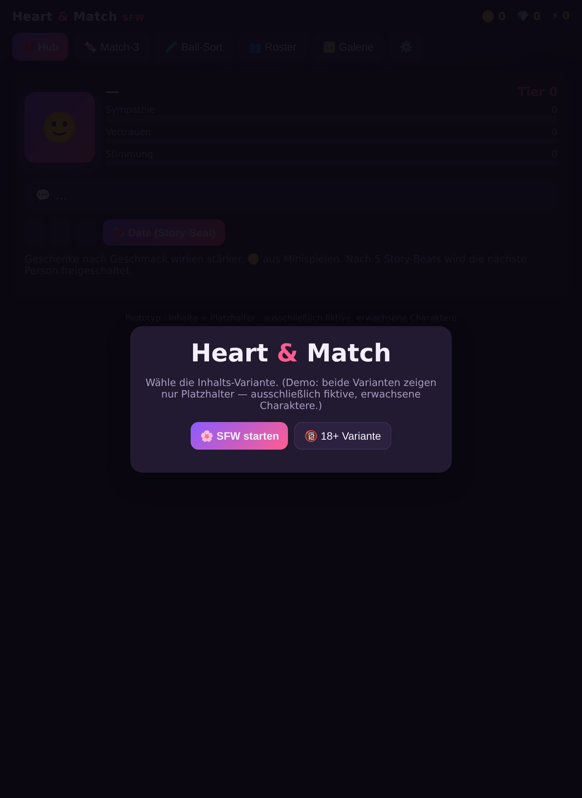
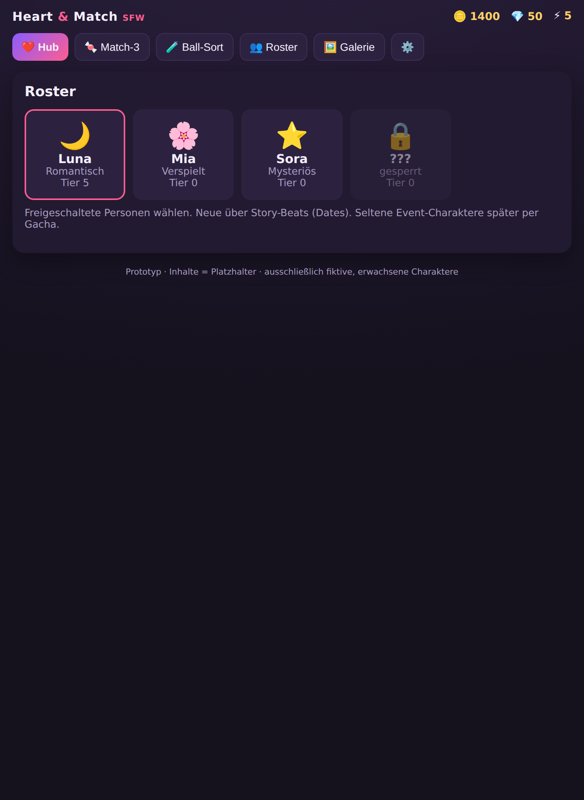
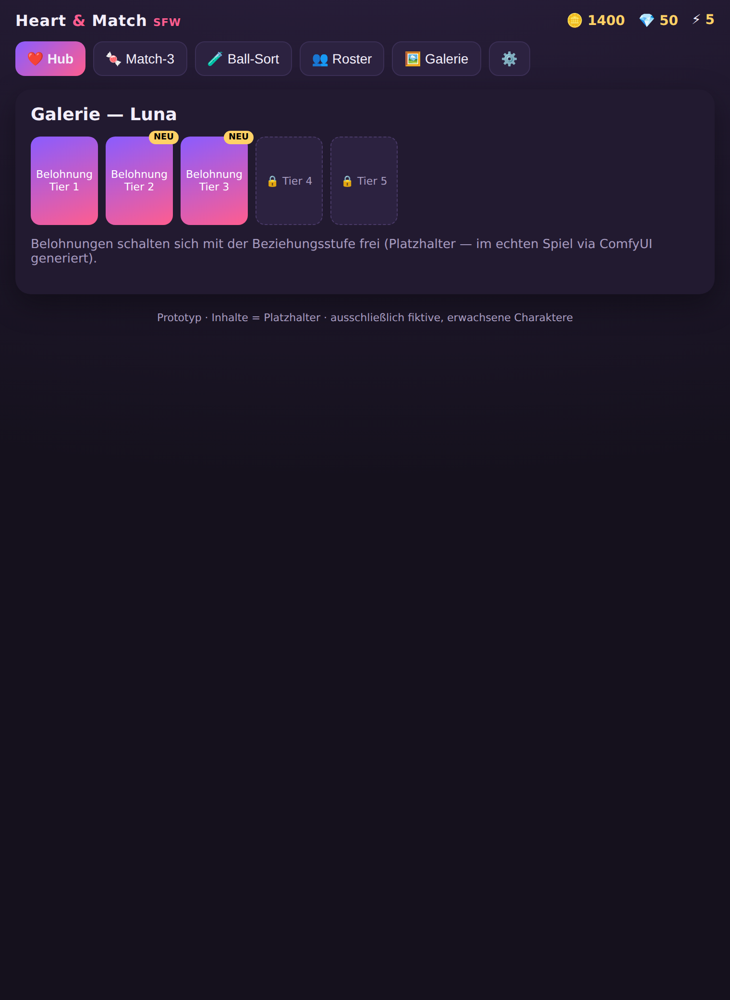

# Heart & Match — Web-Prototyp

Ein **spielbarer Prototyp** der Kernmechanik, der ohne Installation/Build im Browser läuft. Dient zum
schnellen Ausprobieren & Zeigen des Spielgefühls — der echte Client ist das Unity-Projekt unter
[`../unity-game/`](../unity-game/).

## Öffnen

Einfach **`index.html` im Browser öffnen** (Doppelklick genügt — kein Server nötig).

Optional als lokaler Server (falls der Browser `file://` einschränkt):

```bash
cd web-prototype
python3 -m http.server 8080
# dann http://localhost:8080 öffnen
```

## Modus-System (datengetrieben, geteilter Match-3-Kern)

Nach `docs/RESEARCH_MODES.md` aufgebaut: **ein** Match-3-Kern, die Modi unterscheiden sich nur über
**Daten** (Ziele/Regeln/Modifier), nicht über Code. Auswahl im Modus-Hub („🍬 Match-3"):

| Modus | Regeln |
|---|---|
| 📖 **Story** | Zielpunktzahl + Eis räumen, Zug-Limit, Level-Progression (Eis & Ziel wachsen) |
| 📅 **Daily** | Täglich gleiches Board (Datums-**Seed**, reproduzierbar), Zug-Limit, Bestwert |
| ♾️ **Endlos** | Keine Zug-Grenze, kein Ziel — spielen bis kein Zug mehr möglich; Bestwert |
| ⏱️ **Time Attack** | 60 Sekunden, maximale Punkte; Timer-HUD |

Enthält auch `hasValidMove()` + **Auto-Shuffle** (aus der Architektur-Recherche): gibt es keinen gültigen
Zug mehr, wird automatisch neu gemischt (bzw. Endlos endet und zahlt aus).

## Was funktioniert

- **Start-/Age-Gate**: Auswahl SFW / 18+ (Demo — beide nur Platzhalter), Altersbestätigung für 18+.
- **Hub**: aktiver Charakter mit Sympathie/Vertrauen/Stimmung-Balken + Tier, **Dialog-Bubble je
  Persönlichkeit/Tier**, Geschenke mit **Geschmacks-Präferenz** (💗 mag / 💤 mag nicht), Date-Button.
- **Match-3 (echte Früchte 🍎🍊🍋🍉🫐🍇)** auf 3D-Spielfläche: 8×8, Tauschen, Kaskaden,
  4er→Rakete 🚀, 5er→Farbbombe 💥, Ziel → 🪙.
  **Juice:** Partikel-Burst beim Auflösen, Screenshake + Hit-Stop beim Spezialstein-Zünden, Combo-Tonleiter.
  **Hindernis 🧊 Eis** (recherche-basiertes Design): vereiste Früchte sind nicht bewegbar und schmelzen
  Schicht für Schicht durch Matches direkt daneben. **Look nach Genre-Spec:** dünnes Eis = klar/bläulich
  (Frucht sichtbar), dickes Eis = weiß/opak + viele Risse; facettierter Kristall mit Frost-Kanten, Funkeln,
  und **Shatter-Effekt** (Splitter + Schnee-Puff) beim Brechen. **Entwickelt sich mit dem Level:**
  Raureif (L1–2) → Eis (L3–4) → Frost-Kristall (L5–6) → Permafrost (L7+). Level gewonnen erst, wenn Ziel
  erreicht **und** alles Eis geräumt ist.
- **Ball-Sort**: Röhren sortieren, Undo, Lösungserkennung → 🪙.
- **Roster**: alle Charaktere mit Persönlichkeit/Tier, freigeschaltet/gesperrt, Wechsel per Tap.
- **Galerie**: Belohnungs-Tiers pro Charakter mit „NEU"-Badges.
- **Sympathie-Loop**: 🪙 aus Minispielen → Geschenke → Tier steigt → Belohnung in der Galerie.
- **Charakterwechsel** nach 5 Story-Beats; Energie-Regeneration; **Sound** (WebAudio).
- **Persistenz**: Fortschritt wird automatisch im `localStorage` gespeichert (Reset in den Einstellungen).

## Bezug zum echten Spiel

Die Mechanik spiegelt das Unity-Design (Tier-Schwellen, Stimmungs-Multiplikator, Spezialsteine,
lösbarer Ball-Sort). Im echten Spiel sind die Belohnungen Bilder/Videos (via ComfyUI generiert);
hier sind sie Platzhalter-Karten. Inhalte: ausschließlich fiktive, erwachsene Charaktere.






